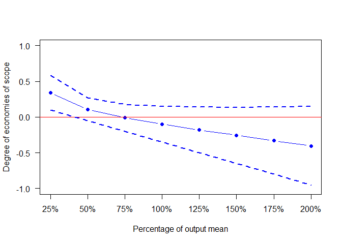
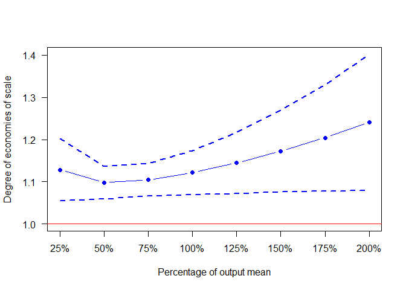

---
output:
  pdf_document: default
  html_document: default
---
<!-- README.md is generated from README.Rmd. Please edit that file -->
### Description

This package utilize the theory of economies of scale and scope (developed by Baumol, Panzar, & Willig (1982))to generate the estimates of average output costs, economies of scale, and economiece of scope for different types of multi-output production industries. So far, this package can reproduce the estimates using FFCQ-M cost function (see Zhang, Worthington, and Hu (in press) for details). This pacakge also offers a quick plotting method to infer the existence of economies of scale and scope. Please see demo below for details.

### Installation

``` r
devtools::install_github("LiangCZhang/Rcess")
```

### Demo

Generate estimates of costs and scale and scope economies

``` r
library(Rcess)
data(unidat)
data = unidat
library(minpack.lm)
model <- nlsLM(costFunction(costName = colnames(unidat)[3], outputName = colnames(unidat)[7:11],
   priceName = colnames(unidat)[4:6], controlName = colnames(unidat)[12:24],
   form = "FFCQ-M"), start = list(b0 = 600, b1 = 0, b2 = 0,
   b3 = 0, b4 = 0, b5 = 0, b11 = 0, b22 = 0, b33 = 0, b44 = 0,
   b55 = 0, b12 = 0, b13 = 0, b14 = 0, b15 = 0, b23 = 0, b24 = 0,
   b25 = 0, b34 = 0, b35 = 0, b45 = 0, bp2 = 0, bp3 = 0, bz1 = 0,
   bz2 = 0, bz3 = 0, bz4 = 0, bz5 = 0, bz6 = 0, bz7 = 0, bz8 = 0,
   bz9 = 0, bz10 = 0, bz11 = 0, bz12 = 0, bz13 = 0), data = unidat,
   trace = F)
vcovCL <- clusterEst(model = model, cluster = unidat$unicode)$vcovCL
intervalData <- cess(data = data, outputName = colnames(unidat)[7:11], priceName = colnames(unidat)[4:6],
                     controlName = colnames(unidat)[12:24], model = model, vcovCL = vcovCL)
```

#### Interval plot for economies of scope (GSE)

``` r

intervalPlot(intervalData = intervalData, estimates = intervalData$GSE, meanLevels = intervalData$meanLevels,
             lowerLevel = intervalData$Lo_GSE,UpperLevel = intervalData$Hi_GSE, ylab = "Degree of economies of scope",h = 0,ylim = c(-1,1))
```



#### Interval plot for ray economies of scale (SRAY)

``` r
intervalPlot(intervalData = intervalData, estimates = intervalData$SRAY, meanLevels = intervalData$meanLevels,
             lowerLevel = intervalData$Lo_SRAY,UpperLevel = intervalData$Hi_SRAY, ylab = "Degree of economies of scale",
             h = 1,ylim = c(min(intervalData$Lo_SRAY,1),max(intervalData$Hi_SRAY)))
```



### References

Baumol, W. J., Panzar, J. C., & Willig, R. D. (1982). Contestable markets and the theory of industry structure. New York, NY: Harcourt Brace Jovanovich.

Zhang, L.-C., Worthington, A. C., & Hu, M. (in press). Cost economies in the provision of higher education for international students: Australian evidence. Higher Education. <doi:10.1007/s10734-016-0078-9>
